# Unit 2: A Distributed Weather Station for ISAK

## Criteria A: Planning

## Problem definition

Dr Ruben wants to cook methamphetamine in his room. This process requires fine and precise control over the temperature
and humidity of the surroundings. He started with a room thermometer but it is hard to manually collect data from the
thermometer, not to mention the temperature error from the room thermometer affects the predictions and adjustments for
the cooking process. He wants to be able to measure the temperature and humidity inside the room accurately so he can
make adjustments accordingly. He also wants the data to be easily comprehensible and accessible. If possible, he would
like to be able to make predictions for the following 12 hours so he can adjust beforehand as he is not present in the
room most of the time. As he is new to this topic, he wants to keep the cost as low as possible.

## Proposed Solution

Considering the client's requirements an adequate solution includes a low cost sensing device for humidity and temperature
and a custom data script that process and analysis the samples acquired. For a low cost sensing device an adequate
alternative is the DHT11 sensor[^1] which is offered online for less than 5 USD and provides adequate precision and
range for the client requirements (Temperature Range: 0°C to 50°C, Humidity Range: 20% to 90%). Similar devices such as
the DHT22, AHT20 or the AM2301B [^2] have higher specifications, however the DHT11 uses a simple serial communication (
SPI) rather than more elaborated protocols such as the I2C used by the alternatives. For the range, precision and
accuracy required in this application the DHT11 provides the best compromise. Connecting the DHT11 sensor to a computer
requires a device that provides a Serial Port communication. A cheap and often used alternative for prototyping is the
Arduino UNO microcontroller [^3]. "Arduino is an open-source electronics platform based on easy-to-use hardware and
software"[^4]. In addition to the low cost of the Arduino (< 6USD), this device is programmable and expandable[^1].
Other
alternatives include different versions of the original Arduino but their size and price make them a less adequate
solution.

**Design statement**  We will design and make a poster for the client who is Dr Ruben. The poster will include the
system diagarma nad visual representation and model of humidity in the said room for 48 hours, and a prediction for the
subsequent 12 hours. It will present the ideal temperatures and humidity for cooking methamphetamine and health levels
for humans. This is achieved through with the software Python on a Raspberry Pi SBC(Single Board Computer) with four
DHT11 sensors. It will take approximately 1 month to complete and will be evaluated according to criterias below

[^1]: Industries, Adafruit. “DHT11 Basic Temperature-Humidity Sensor + Extras.” Adafruit Industries Blog
RSS, https://www.adafruit.com/product/386.
[^2]: Nelson, Carter. “Modern Replacements for DHT11 and dht22 Sensors.” Adafruit Learning
System, https://learn.adafruit.com/modern-replacements-for-dht11-dht22-sensors/what-are-better-alternatives.   
[^3]:“How to Connect dht11 Sensor with Arduino Uno.” Arduino Project
Hub, https://create.arduino.cc/projecthub/pibots555/how-to-connect-dht11-sensor-with-arduino-uno-f4d239.  
[^4]:Team, The Arduino. “What Is Arduino?: Arduino Documentation.” Arduino Documentation | Arduino
Documentation, https://docs.arduino.cc/learn/starting-guide/whats-arduino.

## Success Criteria

1. The solution provides a visual representation of the Humidity and Temperature values inside a dormitory (Local) and
   outside the house (Remote) for a period of minimum 48 hours.
1. ```[HL]``` The local variables will be measure using a set of 4 sensors around the dormitory.
2. The solution provides a mathematical modelling for the Humidity and Temperature levels for each Local and Remote
   locations. ```(SL: linear model)```, ```(HL: non-lineal model)```
3. The solution provides a comparative analysis for the Humidity and Temperature levels for each Local and Remote
   locations including mean, standad deviation, minimum, maximum, and median.
4. ```(SL)```The Local samples are stored in a JSON file and ```(HL)``` posted to the remote server.
5. Create a prediction the subsequent 12 hours for both temperature and humidity.
6. A poster summarizing the visual representations, model and analysis is created. The poster includes a recommendation
   about healthy levels for Temperature and Humidity.

# Criteria B: Design

## System Diagram **SL**

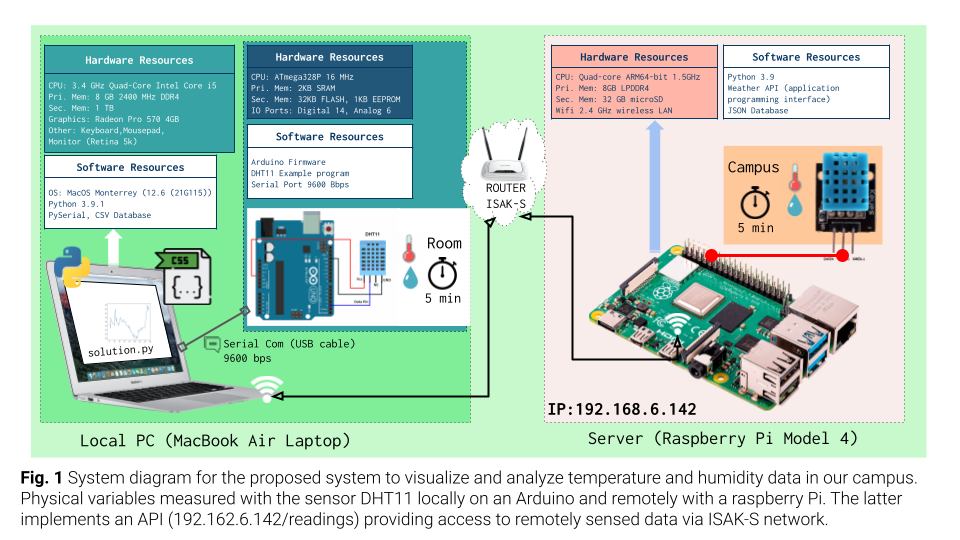

**Fig.1** shows the system diagram for the proposed solution (**SL**). The indoor variables will be measured using an
Arduino microprocessor and the sensor DHT11 conencted to the local computer (Laptop) located inside a room. The outdoor
variables will be requested to the remote server using a GET request to the API of the server
at ```192.168.6.147/readings```. The local values are stored in a CSV database locally.

## System Diagram HL


**Fig.2** shows the system diagram for the proposed solution (**HL**). The indoor variables will be measured using a
Raspberry PI and four DHT11 sensors located inside a room. Four sensors are used to determine more precisely the
physical values and include measurement uncertainty. The outdoor variables will be requested to the remote server using
a GET request to the API of the server at ```192.168.6.147/readings```. The local values are stored in a CSV database
locally and POST to the server using the API and TOKEN authentication. A laptop computer is used for remotely
controlling the local Rasberry Pi using a Dekptop sharing application (VNC Viewer). (Optional) Data from the local
raspberry is downloaded to the laptop for analysis and processing.

## Data Storage

We stored our collected into a single JSON with array formatting. The JSON serves as a backup for our data in case the remote server malfunctions and serves as a quicker way to access our own data when we do graphing. Collected data is also uploaded to ```http://192.168.6.142/readings``` everytime data is collected.

## Record of Tasks

| Task No | Planned Action            | Planned Outcome | Time estimate | Target completion date | Criterion |
|---------|---------------------------|-----------------|---------------|------------------------|-----------|
| 1       | Write the Problem context | To have a clear and defined goal to achieve and what the client wants | 20min    | Nov 22                 | A         |
| 2       | Create BOM(Bill of Materials) | Compile a list of necessary materials | 10min | Nov 22 |A|
| 3       | Finalize Design Statement | To have a clear outline of final goal of our project and tasks that need to completed | 30min | Nov 22 |A|
| 4       | Collect materials and sign Scope of Work document | To aquire all materials in order to achieve project goal and sign document stating materials taken and intended use. | 20min | Nov 29 |A|
| 5       | Install necessary software for development | Prepare computer and Raspberry Pi for coding | 45min | Nov 29 |A|
| 6       | Test run of equipment | To make sure sensors and raspberry pi are working properly. | 60min | Nov 29 |B|
| 7       | Construction of Weather Station | To have the physical part of the weather station prepared | 30min | Nov 29 |B|
| 8       | Create MVP (Minimum Viable Product) | To test most base level function of the product and validate the concept before moving on to coding for the final product | 60min | Nov 29 |C|
| 9 | Register user to server and obtain access token | To create user with secure username and password in order to have elevated access to the server. Access token allows to post to server | 5min | Dec 01 |C|
| 10 | Create code to obtain temperature and humidity data from DHT11s | To be able to collect data from the sensors at an interval of 5 minutes | 30min | Dec 01 |C|
| 11 | Create code that saves collected data to JSON file and sends to server | To be able to have a local backup of data and then post the results to the server | 30min | Dec 01 |C|
| 12 | Create code to obtain data from the school sensors | To be able to get data from the school sensor for future graphing and comparisons | 15min | Dec 01 |C|
| 13 | Create Bash Program to keep alive program | To have a failsafe when the main program fails to stop the loop | 15min | Dec 01 |C|
| 14 | Replace malfunctioning sensors | To replace broken down sensors with functioning one | 5min | Dec 06 |C|
| 15 | Test run of replaced parts | To make sure that the replaced parts are functioning correctly | 15min | Dec 06 |B|
| 16 | Run program for 48 hours in order to collect needed data in R2-10B | Obtain temperature and humidity data from R2-10B for 48 hours at 5 minute intervals | 48 hours | Dec 06-07 |C|
| 17 | Create flow diagrams for interesting aspects of the code | To clearly display the functions used in the program | 2 hours | Dec 08 |B|
| 18 | Create code for graphing the room data and school data | To be able to visualize the collected data and prepare for linear fit functions | 45min | Dec 11 |C|
| 19 | Include more data into graph | To plot smoothed data with additional stats like min, max, mean and error bars and also polynomial functions for predictions | 1 hour | Dec 11 |C|
| 20 | Video Outline | To organize what needs to be included in the video | 1 hour | Dec 11 |D|
| 21 | Create Scientific Poster | To present the background information, methodologies, materials, results, analysis and conclusion for the client in a clear and easy to understand way | 2 hour | Dec 11 |D|
| 22 | Beautify README file | To make README file more easily-understandable | 3 hour | Dec 11 |B|
| 23 | Create Video Demonstration | To make the video in order to demonstrate the solution and the findings | 4 hour |  |D|
| 24 | Add Computation Thinking Part | To show understanding in Computational Thinking skills | 45min | Dec 12 |B|

## Flow Diagrams

### MVP Program
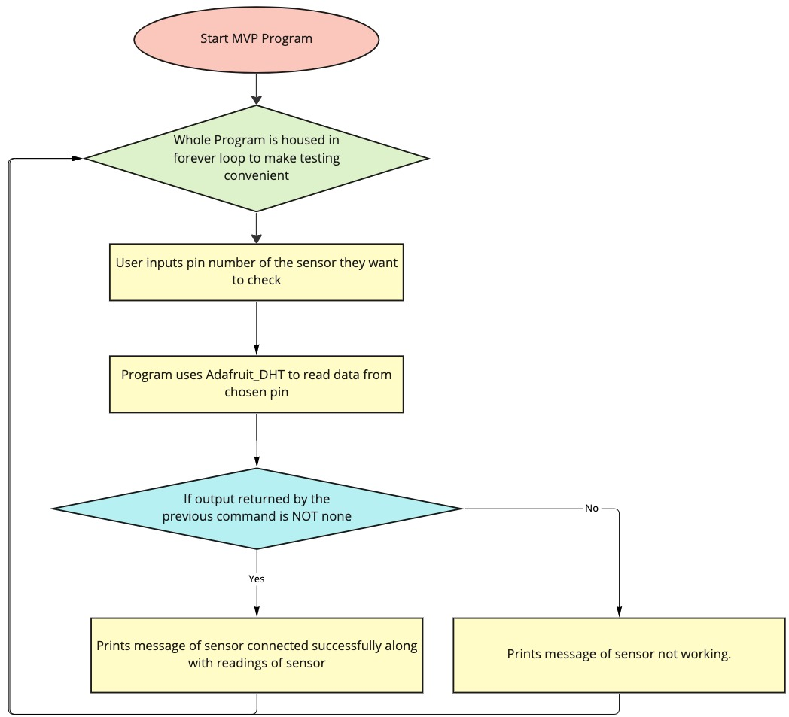

*Fig.3* **Flow diagram for the MVP program.**

### Bash Program to keep alive main program
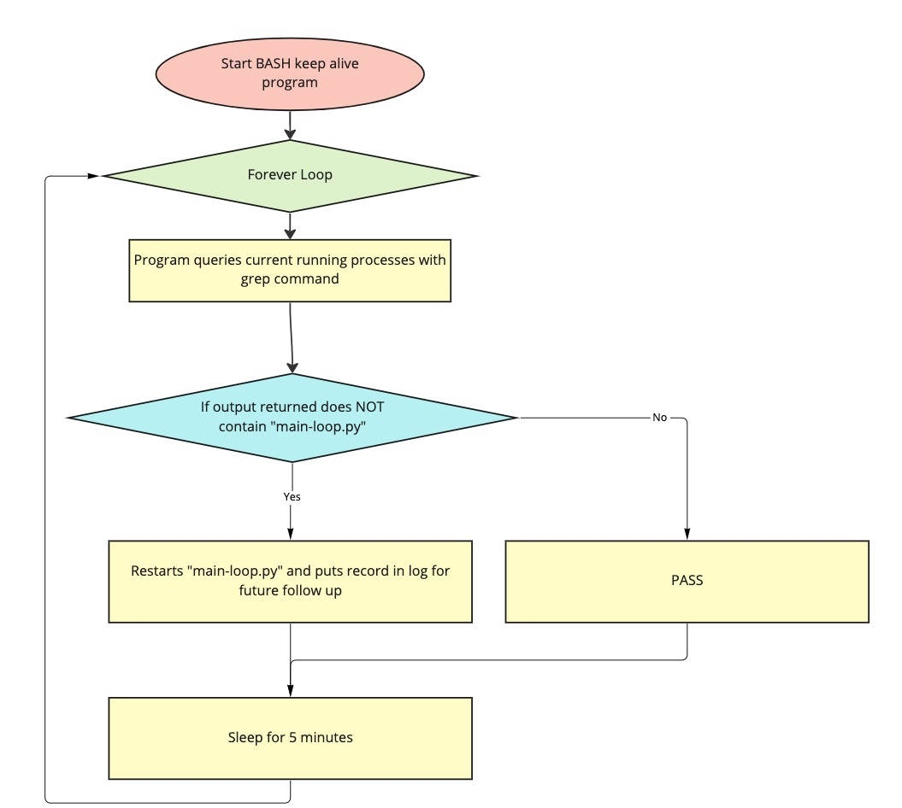

*Fig.4* **Flow diagram for the Bash program.**
### Main Program
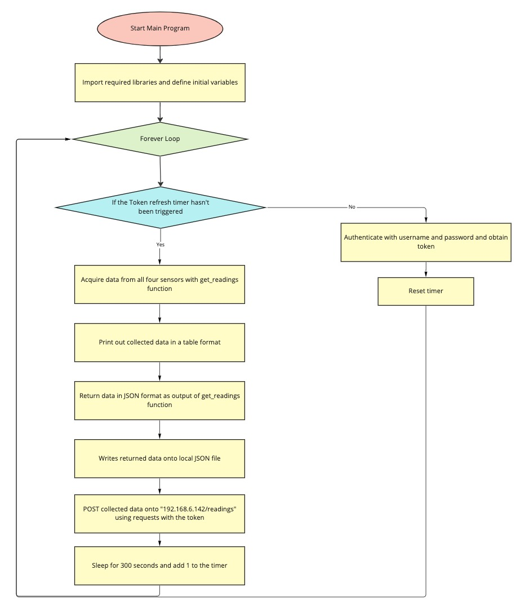

*Fig.5* **Flow diagram for the main program.**


## 	Test Plan

| Type                | Input                                      | Process                                                      | Anticipated Outcome                                          |
| ------------------- | ------------------------------------------ | ------------------------------------------------------------ | ------------------------------------------------------------ |
| Integration Testing | Raspberry Pi, SSH and VS Code              | 1. Download and Install VS Code 2. Open Raspberry Pi as remote in VS Code | VS Code will connect to Raspberry Pi through the SSH protocal |
| Unit Testing        | Authentication Code, username and password | 1. Run Code                                                  | Program should print the access token obtained from the server with the given username and password |
| Unit Testing        | Code to obtain data from DHT11s (MVP)      | 1. Run Code 2. Input pin number of sensor (4,17,22,27)when prompted by program | Program will print if the sensor is working, and if it's working, the data from the sensor to the terminal |
| Performance Testing | MVP Code                                   | 1. Run code. 2. Input pin number of sensor(4,17,22,27) when prompted by program 3. Measure time until output is printed on the terminal | Code will collect data and display an output on the temrinal in 5 seconds |
| Unit Testing        | Code for writing to JSON files             | 1. Run code.                                                 | Data will be collected from sensors and formatted and finally inserted into the JSON file along with the datetime and sensor_id |
| Integration Testing | Bash Program and Main Program              | 1. Run code. 2. Wait and see if data is being added to the JSON file every five minutes | Temperature and humidity data from all four sensors should be appended to the same JSON file with datetime |
| Unit Testing        | Graphing Code                              | 1. Run code. 2. Wait for graph to appear 3. Reference JSON file to compare accuracy of data | Graph and respective statistics should line up with data from JSON file |

# Criteria C: Development

## Existing Tools

| Software/Development Tools | Coding Structure Tools | Libraries    |
| -------------------------- | ---------------------- | ------------ |
| Python                     | For Loops              | datetime     |
| VS Code                    | API requests           | requests     |
| Terminal                   | Functions              | Time         |
| SSH                        | JSON file              | Adafruit_DHT |
| Bash                       |                        | Json         |
|                            |                        |              |

## List of techniques used

1. Functions
2. While Loops
3. Conditions
4. JSON formating
5. HTTP requests
6. Token Authentication
7. GPIO Interface
8. Graph Plotting

## Computational Thinking

#### Decomposition

In computational thinking, decomposition refers to breaking a complex problem or system into parts that are easier to conceive, understand, program, and maintain. In the part for uploading the data to the server, we broke the problem down to three main aspects: Collecting Data, Formating Data and Pushing Data. Following these three categories, we individually coded each part and made sure it works well together. See snippet of main program below for reference:

```py
def get_readings(auth):
    humidity1, temperature1 = Adafruit_DHT.read_retry(11, sensor_1_pin)
    datetime1 = datetime.datetime.now()
    humidity2, temperature2 = Adafruit_DHT.read_retry(11, sensor_2_pin)
    datetime2 = datetime.datetime.now()
    humidity3, temperature3 = Adafruit_DHT.read_retry(11, sensor_3_pin)
    datetime3 = datetime.datetime.now()
    humidity4, temperature4 = Adafruit_DHT.read_retry(11, sensor_4_pin)
    datetime4 = datetime.datetime.now()
    
    humiditys = [humidity1, humidity2, humidity3, humidity4]
    temperatures = [temperature1, temperature2, temperature3, temperature4]
    sensortempid = [sensor1tempid, sensor2tempid, sensor3tempid, sensor4tempid]
    sensorhumidityid = [sensor1humidityid, sensor2humidityid, sensor3humidityid, sensor4humidityid]

    for i in range(4):
        senddata(temperatures[i], sensortempid[i], auth)
        senddata(humiditys[i], sensorhumidityid[i], auth)

    average_temp = (temperature1 + temperature2 + temperature3 + temperature4) / 4
    average_humidity = (humidity1 + humidity2 + humidity3 + humidity4) / 4
    median_temp = statistics.median([temperature1, temperature2, temperature3, temperature4])
    median_humidity = statistics.median([humidity1, humidity2, humidity3, humidity4])

    #print nice table
    print("\r| Sensor | Temperature | Humidity |")
    print("|--------+-------------+----------|")
    print("| 1      |"+str(temperature1).center(13)+"|"+str(humidity1).center(10)+"|")
    print("| 2      |"+str(temperature2).center(13)+"|"+str(humidity2).center(10)+"|")
    print("| 3      |"+str(temperature3).center(13)+"|"+str(humidity3).center(10)+"|")
    print("| 4      |"+str(temperature4).center(13)+"|"+str(humidity4).center(10)+"|")
    print("|--------+-------------+----------|")
    print("| Average|"+str(average_temp).center(13)+"|"+str(average_humidity).center(10)+"|")
    print("| Median |"+str(median_temp).center(13)+"|"+str(median_humidity).center(10)+"|")
    print("|--------+-------------+----------|\r")


    reading = {
        "datetime": str(datetime.datetime.now()),
        "average_temp": average_temp,
        "average_humidity": average_humidity,
        "median_temp": median_temp,
        "median_humidity": median_humidity,
        "readings": [
            {
                "temperature": temperature1,
                "humidity": humidity1,
                "sensor_id": 1,
                "datetime": str(datetime1)
            },
            {
                "temperature": temperature2,
                "humidity": humidity2,
                "sensor_id": 2,
                "datetime": str(datetime2)
            },
            {
                "temperature": temperature3,
                "humidity": humidity3,
                "sensor_id": 3,
                "datetime": str(datetime3)
            },
            {
                "temperature": temperature4,
                "humidity": humidity4,
                "sensor_id": 4,
                "datetime": str(datetime4)
            }
        ]
        }

    return reading
```


#### Pattern recognition, generalization and abstraction

When plotting graphs and dealing with data smoothing and statistical calculations, we noticed that there's a lot of repeated code used to take data out from different sensors and similar calculations. This made the main program very cluttered, inefficient and hard to debug. To resolve these issues, we chose to start a library to store the code to smooth data and calculate statistics to reduce the code repetition in the main program and improve overall efficiency of our program. This is shown below with a part of library code:

```py
def smoothing(data:list, size_window:int=12) -> list:
    x = []
    y = []
    for i in range(0, len(data), size_window):
        #print(data[i:i+size_window])
        segment_mean = sum(data[i:i+size_window])/size_window
        y.append(segment_mean)
        x.append(i)
    return x, y
```

#### Algorithms

In the initial code and the Minimum Viable Product, we utilized a while loop in order for the code to keep running every five minutes at specific intervals. This solution proved to be inefficient becuase the task of getting readings every 5 minutes for 48 hours straight, which would mean leaving the SSH connection on for the whole time, basically disabling the connected laptop for 2 days which is not feasible. To solve this problem, we first tried using a crontab task that would automatically run the code every 5 minutes. However, due to multiple system issues with our Raspberry Pi, we attempted multiple times to still no avail. Instead, we resorted to using the while loop and a bash program to make sure the program was running in the background.

#### Bash Program

```bash
source "/home/dev/Program/venv/bin/activate" && python3 "/home/dev/Program/main-loop.py" > /home/dev/Program/logger.log
output=$(ps -aux | grep python3)
while true
do
if [[ $output != *"main-loop.py"* ]]
then
source "/home/dev/Program/venv/bin/activate" && python3 "/home/dev/Program/main-loop.py" > /home/dev/Program/logger.log
fi
sleep 5
done
```

This program checks if the main program is running, and automatically restarts the program if it's not.

## Development

Below are the key parts of code development for the project

####  Libraries

To reduce the lines of repetitve, we included frequently used functions into a library to improve code readbility and simplicity.

```py
import requests

def get_readings(id:int, url:str="http://192.168.6.142/readings") -> list:
    req = requests.get(url)
    data = req.json()
    readings = data["readings"][0]
    temp = []
    for sample in readings:
        if sample["sensor_id"] == id:
            temp.append(sample["value"])
    return temp

def smoothing(data:list, size_window:int=12) -> list:
    x = []
    y = []
    for i in range(0, len(data), size_window):
        #print(data[i:i+size_window])
        segment_mean = sum(data[i:i+size_window])/size_window
        y.append(segment_mean)
        x.append(i)
    return x, y
```

#### MVP - Minimum Viable Product

In order to validate our concept of creation, we created a MVP as a prototype to make sure our concept is reliable and achievable. The MVP code gets data from each sensor and displays the output in the terminal. Please refer to the code below:

Link to MVP video: [Click Me](https://drive.google.com/file/d/1jyDV30ro8WImT-cAwjz0hzBM_ffVr-dd/view?usp=share_link)

```py
#!/usr/bin/python3
import sys
import Adafruit_DHT
autocheck = ""
autocheck = str(autocheck)

while True:
    if autocheck != "":
        Adafruit_DHT.read_retry(11, autocheck)
    else:
        tocheck = input("Enter sensor number to check: ")
        if Adafruit_DHT.read_retry(11, tocheck) is not None:
            print("Sensor pin "+tocheck+" is connected")
            h, t = Adafruit_DHT.read_retry(11, tocheck)
            print("Temperature: "+str(t)+"C")
            print("Humidity: "+str(h)+"%")
        else:
            print("Sensor pin "+tocheck+" not working")
```

#### Registration of sensors on server

Authenticating and creating 8 sensors. Code is as follows:

```py
import requests

user = {"username": "xxx", 'password':'xxxxxxxx'}
#for security reasons, the username and passwords are masked!

req = requests.post('http://192.168.6.142/login', json=user)
access_token = req.json()["access_token"]
print(access_token)
access_token = req.json()["access_token"]
auth = {"Authorization": f"Bearer {access_token}"}

for i in range(8):
    if i < 5:
        new_sensor ={ "type": "Temperature","location": "R2-10B", "name": ("sensor_alex_bern"+str(i)),"unit":"C" }
    else:
        new_sensor ={ "type": "Humidity","location": "R2-10B", "name": ("sensor_alex_bern"+str(i)),"unit":"%" }
    r = requests.post('http://192.168.6.142/sensor/new', json=new_sensor, headers=auth)
    print(r.json())
```


#### Complex Graphs - 4+1 Data representation

After much consideration, we decided to present the data in a way where the average of the four sensors can be viewed. The code plots the graphs of smoothed data from all 4 sensors and a larger graph of the average temperature datas. Refer to the code and graphs below:


Temperature:

```py
from matplotlib import pyplot as plt
from matplotlib.gridspec import GridSpec
import library as u2l
sensors = [28,29,30,31]
values = []
for s in sensors:
    x,smoothed = u2l.smoothing(u2l.get_readings(s)[:])
    values.append(smoothed)

mean_per_hour = []
for i in range(len(values[0])):
    data = [values[n][i] for n in range(4)]
    mean_per_hour.append(sum(data)/len(sensors))
print("Ready to plot")

fig=plt.figure(figsize=(12,12))
gs = GridSpec(4, 4, figure=fig)
ax = fig.add_subplot(gs[:,0:3])
plt.title("Average of sensors")
plt.plot(x, mean_per_hour)
plt.ylim([20,28])
plt.xlabel("Samples per hour")
plt.ylabel("Celsius")

for row, my_color in [(0,"#e63946"),(1,"#a8dadc"),(2,"#457b9d"),(3,"#1d3557")]:
    ax = fig.add_subplot(gs[row,3])
    plt.plot(x, values[row], color=my_color)
    plt.title("Sensor "+str(sensors[row]))

plt.show()
```

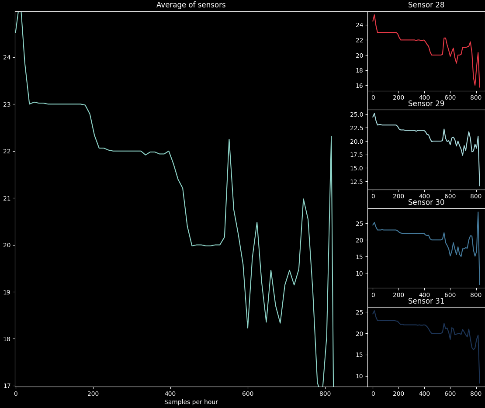

*Fig.6* **Complex Graph for Temperature**

Humidity:

```py
from matplotlib import pyplot as plt
from matplotlib.gridspec import GridSpec
import library as u2l
plt.style.use('dark_background')
sensors = [23,24,25,26]
values = []
for s in sensors:
    x,smoothed = u2l.smoothing(u2l.get_readings(s)[:])
    values.append(smoothed)

mean_per_hour = []
for i in range(len(values[0])):
    data = [values[n][i] for n in range(4)]
    mean_per_hour.append(sum(data)/len(sensors))
print("Ready to plot")

fig=plt.figure(figsize=(12,12))
gs = GridSpec(4, 4, figure=fig)
ax = fig.add_subplot(gs[:,0:3])
plt.title("Average of sensors")
print(len(x))
print(len(mean_per_hour))
print("added 25")
print(len(x))
mean_per_hour.append(25)
values.append(25)
print(len(mean_per_hour))
plt.plot(x, mean_per_hour)
plt.ylim([20,28])
plt.xlabel("Samples per hour")
plt.ylabel("%")

for row, my_color in [(0,"#e63946"),(1,"#a8dadc"),(2,"#457b9d"),(3,"#1d3557")]:
    ax = fig.add_subplot(gs[row,3])
    x = []
    for i in range(len(values[row])):
        x.append(i)
    plt.plot(x, values[row], color=my_color)
    plt.title("Sensor "+str(sensors[row]))

plt.show()
```

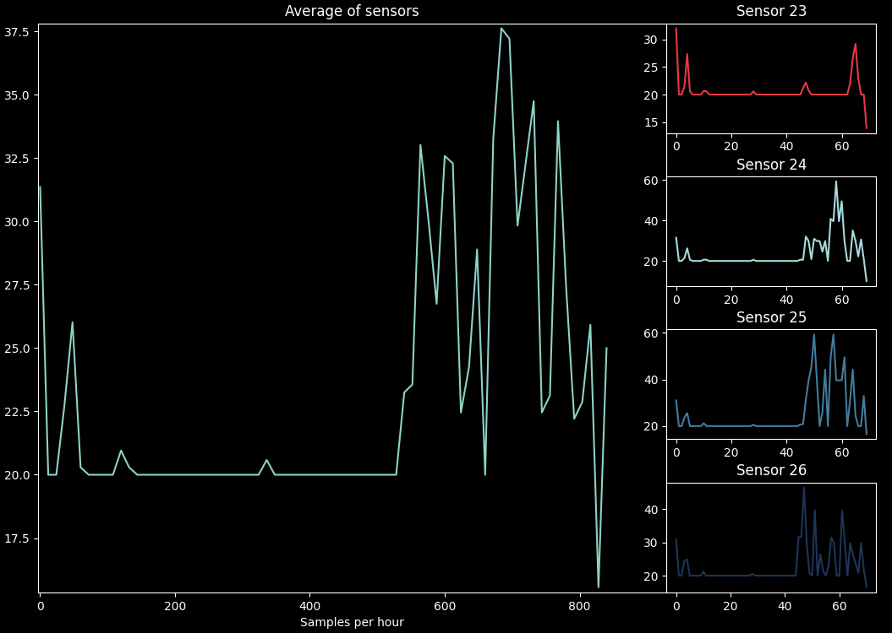

*Fig.7* **Complex Graph for Humidity**

#### Polynomial fit w/ predictions 

This piece code aims to plot the smoothed average data from the sensors and plot a polynomial fit for said data. This also predicts dta for 12 hours after the collected data ends. Refer to the code and graphs below:

```py
#Only code for temperature shown here for simplicity purposes
req = requests.get("http://192.168.6.142/readings")
data = req.json()
readings = data["readings"][0]
sensor_id_1 = 23
sensor_id_2 = 24
sensor_id_3 = 25
sensor_id_4 = 26
window = 6
window *= 4 # there is four sensors
fig_width= 15
fig_height= 25

samples = []
temp = []

for sample in readings:
    if sample["sensor_id"] == sensor_id_1 or sample["sensor_id"] == sensor_id_2 or sample["sensor_id"] == sensor_id_3 or sample["sensor_id"] == sensor_id_4:
        temp.append(sample["value"])

for i in range(0, len(temp), window):
    segment_mean = sum(temp[i:i+window])/window
    samples.append(segment_mean)

humidity_samplesples = samples

for i in range(len(humidity_samplesples)):
    if humidity_samplesples[i] < 20:
        humidity_samplesples[i] = 20

xhum = []
for i in range(len(humidity_samplesples)):
    xhum.append(i*(window/4))

phumidity = np.poly1d(np.polyfit(xhum, humidity_samplesples, 3))

plt.title('Humidity Predictions')
plt.xlabel('Smooth measurement number')
plt.ylabel('Humidity (%)')

plt.plot(xhum, humidity_samplesples, 'o', xhum, phumidity(xhum), '-')

plt.show()
```

Temperature:

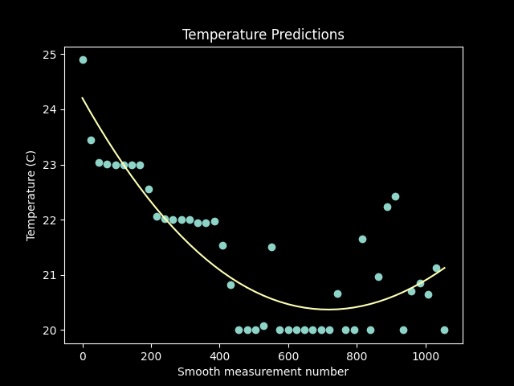

*Fig.8* **Polyfit Graph for Temperature**

Humidity:

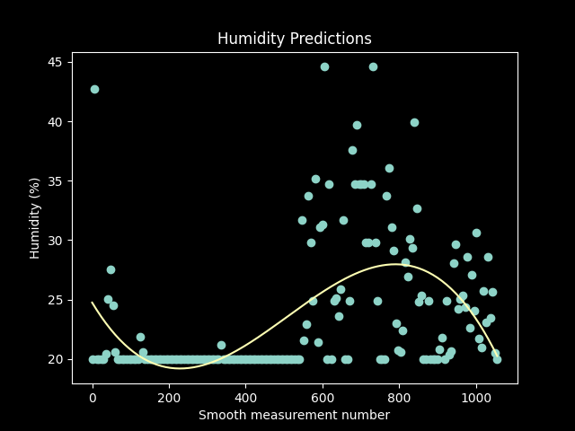

*Fig.9* **Polyfit Graph for Humidity**

#### Errors bars and other statistical data

This part of the code calculates the maximum, minimum and mean values of the plotted data, and indicates the vales with a line which is parallel to the x-axis. This code also includes plots error bars to indicate the standard deviation of the data. Refer to code and graphs below

Code :

```py
#Only code for Temperature shown here for simplicity purposes
req = requests.get("http://192.168.6.142/readings")
data = req.json()
readings = data["readings"][0]
sensor_id_1 = 23
sensor_id_2 = 24
sensor_id_3 = 25
sensor_id_4 = 26
window = 36
window *= 4 # there is four sensors
fig_width= 15
fig_height= 25

samples = []
temp = []

for sample in readings:
    if sample["sensor_id"] == sensor_id_1 or sample["sensor_id"] == sensor_id_2 or sample["sensor_id"] == sensor_id_3 or sample["sensor_id"] == sensor_id_4:
        temp.append(sample["value"])

humidity_samplespleslocal = samples

for i in range(len(humidity_samplespleslocal)):
    if humidity_samplespleslocal[i] < 20:
        humidity_samplespleslocal[i] = 20

xhum = []
for i in range(len(humidity_samplespleslocal)):
    xhum.append(i*(window/4))

low = []
for i in range(len(humidity_samplespleslocal)):
    low.append(humidity_samplespleslocal[i] - 5)

high = []
for i in range(len(humidity_samplespleslocal)):
    high.append(humidity_samplespleslocal[i] + 5)


mean = []
standard_deviation = []
for i in range(len(humidity_samplespleslocal)):
    data = [humidity_samplespleslocal[i], low[i], high[i]]
    mean.append(np.mean(data))
    standard_deviation.append(np.std(data))

for i in range(0, len(temp), window):
    segment_mean = sum(temp[i:i+window])/window
    samples.append(segment_mean)


# max value of the readings
max_value = max(humidity_samplespleslocal)
# min value of the readings
min_value = min(humidity_samplespleslocal)
# average value of the readings
average_value = sum(humidity_samplespleslocal)/len(humidity_samplespleslocal)

plt.figure(figsize=(fig_width,fig_height))
plt.subplot(4,1,1)
plt.plot(xhum, humidity_samplespleslocal, 'o', color="lightblue")
plt.title("Local Humidity")
plt.errorbar(xhum , humidity_samplespleslocal, yerr=5, fmt='o', color="lightblue")
plt.text(600, 19, """20 is the minimum value of the sensor""", fontsize=10, color='r')
plt.ylabel("Average Humidity(%)")
plt.xlabel("Values")
plt.fill_between(xhum, low, high, color='lightblue', alpha=0.5)
plt.axhline(y=max_value, color='r', linestyle='-')
plt.axhline(y=min_value, color='r', linestyle='-')
plt.axhline(y=average_value, color='r', linestyle='-')
plt.text(-20, (max_value), """Max value: {}""".format(round(max_value, 2)), fontsize=10, color='r')
plt.text(-20, (min_value), """Min value: {}""".format(round(min_value, 2)), fontsize=10, color='r')
plt.text(-20, (average_value), """Average value: {}""".format(round(average_value, 2)), fontsize=10, color='r')
plt.axhline(y=20, color='r', linestyle='-')

plt.show()
```

Temperature:

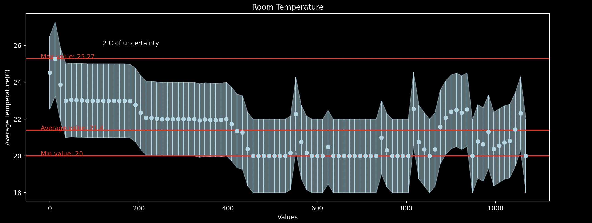
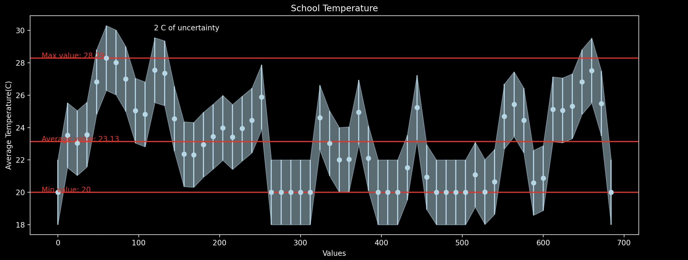

*Fig.10* **Error Bar Graph for Temperature**

Humidity:

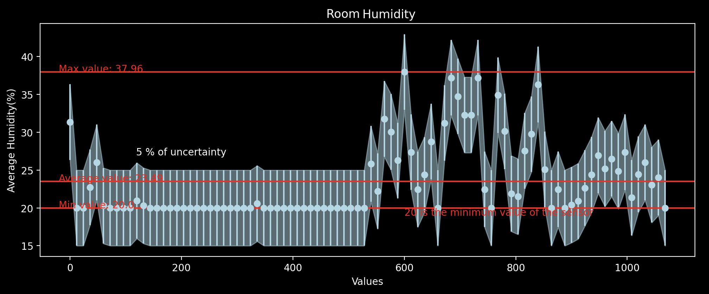
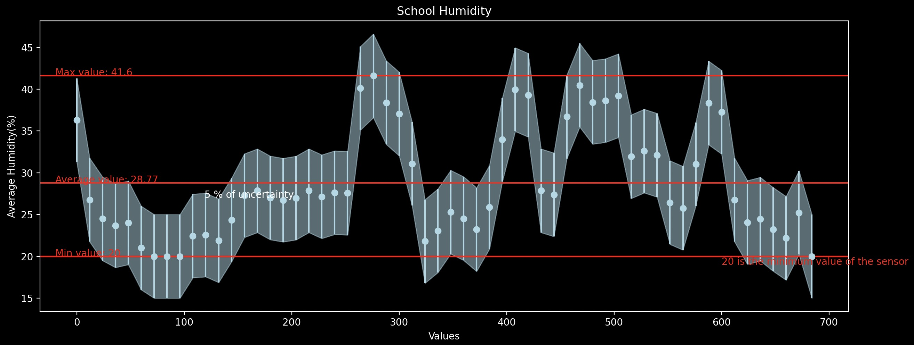

*Fig.11* **Error Bar Graph for Humidity**

# Criteria D: Functionality

## Scientific Poster

*Insert Poster

*Fig.12* **Scientific Poster documenting the objective, methodologies and conclusions of our Weather Station project**

## Demonstration Video

A 7 min video demonstrating the proposed solution with narration
